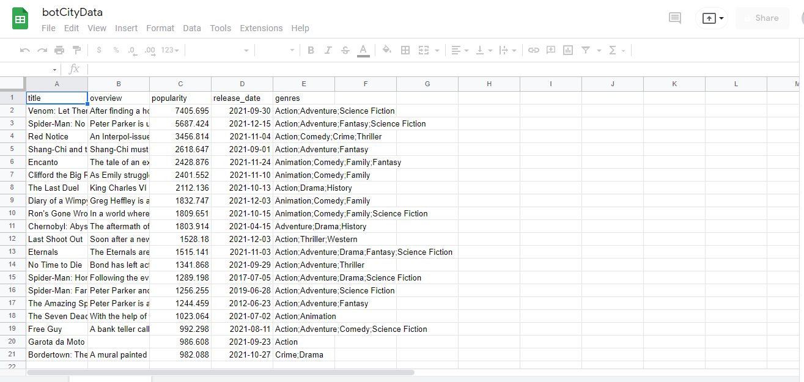

# BotTable

> A bot that fills a spreadsheet.

The bot takes from an API the most popular movies as data and turns it into a spreadsheet, so human can read and parse the data.

## The Movie Database

We use its API to get the data

### Pandas

Once we got the data, we filter it and make a ".csv" file from a DataFrame created by the data.

## Bot

The bot will take care of importing the ".csv" file into a google spreadsheet
